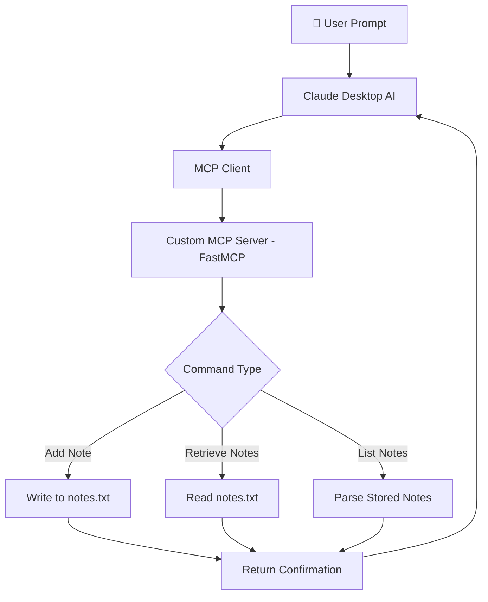

<div align="center">

# 🧠 NoteFlow

### AI-Powered Sticky Notes via a Custom MCP Server

**A lightweight Model Context Protocol (MCP) server that enables AI assistants to create, retrieve, and manage sticky notes using natural language.**
*Turn simple conversations into persistent notes for productivity, brainstorming, and reminders.*

<br>

[](https://www.python.org/)
[](https://github.com/ai-collection/mcp)
[](https://github.com/astral-sh/uv)
[](https://claude.ai/)
[]()

</div>

---

# 📖 What is NoteFlow?

NoteFlow is a **custom MCP (Model Context Protocol) server** designed to bring persistent sticky notes into AI workflows.

Instead of manually managing notes in separate apps, users can simply **ask their AI assistant** to create, store, or retrieve notes using natural language.

When integrated with AI clients like **Claude Desktop**, NoteFlow allows the assistant to:

* Save reminders
* Store ideas
* Retrieve previously saved notes
* Maintain persistent context across conversations

All notes are stored locally in a simple `.txt` file, making the system **lightweight, transparent, and fully customizable**.

---

# ✨ Features

| Feature                               | Description                                                |
| ------------------------------------- | ---------------------------------------------------------- |
| 🧠 **Custom MCP Server**              | Implements a fully functional MCP server using FastMCP     |
| 📝 **Natural Language Note Creation** | AI assistants can add notes directly through commands      |
| 📖 **Note Retrieval**                 | Retrieve previously saved notes instantly                  |
| 💾 **Persistent Storage**             | Notes are stored locally in a `.txt` file                  |
| ⚡ **Fast Python Environment**         | Uses the modern `uv` package manager                       |
| 🔗 **Claude Desktop Integration**     | Automatically registers tools inside Claude                |
| 🧩 **Extensible Design**              | Easily add new tools like delete, tag, or categorize notes |

---

# 🏗️ System Architecture

### Request Flow



---

### MCP Workflow

The MCP server exposes **custom tools** that the AI client can call.

1️⃣ The user asks the AI assistant to save or retrieve a note
2️⃣ The assistant sends a tool request through **MCP**
3️⃣ The **FastMCP server processes the request**
4️⃣ Notes are written to or retrieved from `notes.txt`
5️⃣ The response is returned to the AI client

This architecture allows **AI assistants to interact with local tools safely and efficiently.**

---

# 🛠️ Technology Stack

### Core Backend

| Component             | Technology        |
| --------------------- | ----------------- |
| Programming Language  | `Python 3.12`     |
| MCP Server Framework  | `FastMCP`         |
| Package Manager       | `uv`              |
| Storage               | Local `.txt` file |
| AI Client Integration | Claude Desktop    |

---

# 📂 Project Structure

```text
ai-sticky-notes-mcp/
│
├── main.py            # MCP server logic (tools, prompts, handlers)
├── notes.txt          # Persistent storage for sticky notes
└── README.md          # Project documentation
```

---

# 🚀 Installation & Setup

## Prerequisites

* Python 3.12+
* Claude Desktop (optional but recommended)

---

# 1️⃣ Install `uv`

### Windows (PowerShell)

```powershell
powershell -ExecutionPolicy ByPass -c "irm https://astral.sh/uv/install.ps1 | iex"
```

### Mac / Linux (curl)

```bash
curl -LsSf https://astral.sh/uv/install.sh | sh
```

### Or with `wget`

```bash
wget -qO- https://astral.sh/uv/install.sh | sh
```

---

# 2️⃣ Initialize the Project

```bash
uv init .
```

---

# 3️⃣ Add MCP Dependency

```bash
uv add "mcp[cli]"
```

---

# 🏃 Running the MCP Server

Place all server logic inside **`main.py`**.

Then install the MCP server:

```bash
uv run mcp install main.py
```

This registers the MCP server so AI clients can discover it automatically.

---

# 🔗 Claude Desktop Integration

If **Claude Desktop** is installed:

1️⃣ Run:

```bash
uv run mcp install main.py
```

2️⃣ Claude will automatically detect your MCP server.

3️⃣ Restart Claude if tools do not appear:

* Open **Task Manager**
* End the **Claude Desktop process**
* Restart the app

Your MCP tools should now be available.

---

# 🌐 MCP Tools Example

Your server can expose tools such as:

| Tool           | Description                     |
| -------------- | ------------------------------- |
| `add_note`     | Save a new sticky note          |
| `get_notes`    | Retrieve all notes              |
| `search_notes` | Find notes containing a keyword |

Example interaction:

```
User: Remember that I need to finish my ML assignment tonight.

Claude: Note saved successfully.
```

---

# ⚙️ Configuration

| Setting            | File           | Description                        |
| ------------------ | -------------- | ---------------------------------- |
| Notes Storage      | `notes.txt`    | Local file where notes are stored  |
| MCP Tools          | `main.py`      | Define tools and commands          |
| Client Integration | Claude Desktop | Registers MCP server automatically |

---

# 🐛 Known Issues & Troubleshooting

### MCP server not visible in Claude

Restart the Claude desktop application:

1. Open **Task Manager**
2. End the **Claude process**
3. Restart the app

---

### Notes not saving

Ensure that:

* `notes.txt` exists in the project directory
* The MCP server has permission to write to the file

---

# 🔮 Future Improvements

* 📂 Note tagging and categorization
* 🧠 Semantic search using embeddings
* 🗑️ Delete or edit notes
* ☁️ Cloud storage integration
* 🔗 Multi-agent MCP workflows

---

<div align="center">

<br>

<i>Making AI assistants remember what matters.</i>

<br><br>

<b>NoteFlow</b> — because ideas shouldn't disappear.

</div>
